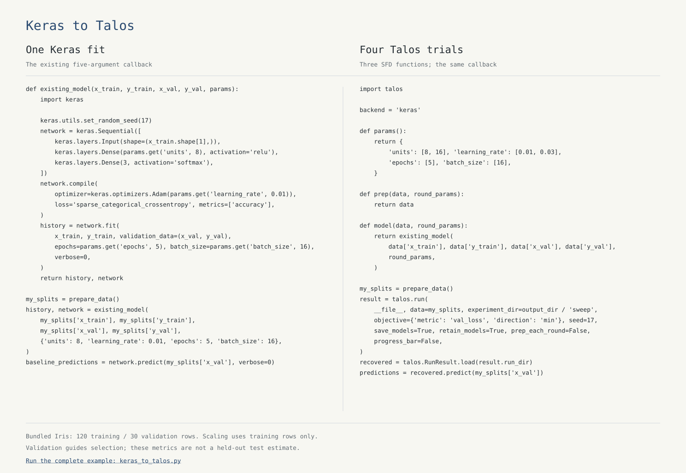

> Talos has moved to its next generation. Talos 2 is in active maintenance. The established Talos 1.x series will remain supported at least until 2028. To keep using the latest 1.x release, install `python -m pip install 'talos==1.4' 'ipython<9'` in a separate Python 3.10 or 3.11 environment. The maintainer reports no breaking bug found or reported in Talos 1.x during the past two years.

# Talos

Hyperparameter experiments with Keras, TensorFlow and PyTorch.

[Talos](https://github.com/autonomio/talos) · [Key features](#key-features) · [Examples](#examples) · [Install](#install) · [Support](#how-to-get-support) · [Docs] · [Issues][GitHub Issue Tracker] · [Cite](#citations) · [License](#license) · [Download](https://github.com/autonomio/talos/archive/refs/heads/master.zip)

[](https://github.com/autonomio/talos/actions/workflows/ci.yml)
[](https://www.bestpractices.dev/en/projects/15140)
[](https://autonomio.github.io/talos/coverage/coverage.html)
[](https://scorecard.dev/viewer/?uri=github.com/autonomio/talos)

Talos helps you turn the model you already have into a repeatable parameter experiment. You keep control of your Keras, TensorFlow or PyTorch model and its training code. Talos runs the candidate settings, records histories and helps you inspect, select and recover trained models.

Talos is made for researchers, data scientists and data engineers who want to remain in complete control of their models, with less time spent hopping between parameter settings. Start in a notebook with the familiar `Scan` interface. When an experiment needs a reusable definition, use a single Python file, a manifest and the CLI.



The comparison uses actual model code and the real Iris dataset. [Open the paired source](examples/keras_to_talos.py), or follow the [first-sweep guide](docs/Guides/Quickstart.md). The brief training runs demonstrate the interface; they do not establish model performance.

## Key features

- Keras, TensorFlow/tf.keras and PyTorch, with framework imports kept optional.
- The familiar `Scan`, `Analyze`/`Reporting`, `Predict`, `Evaluate`, `Deploy` and `Restore` interfaces.
- Grid and sampled searches, reducers, custom strategies and local control files.
- Notebook workflows, single-file experiment definitions and a CLI on one executor.
- Content-addressed manifests, trial histories, source and data identities, checkpoints and intervention records.
- Trained model recovery, with explicit factories or custom objects where the framework requires them.

You choose the data, splits, training method and evaluation protocol. Talos records the experiment around that work. See the [workflow overview](docs/Overview.md), [interface reference](docs/Reference/README.md) and [migration guide](docs/Migration.md).

## Examples

The original notebook paths remain a good way to get to know Talos:

| Start here | What it covers |
| --- | --- |
| [Simple](https://nbviewer.org/github/autonomio/talos/blob/master/examples/A%20Very%20Short%20Introduction%20to%20Hyperparameter%20Optimization%20of%20Keras%20Models%20with%20Talos.ipynb) | A short introduction to a Keras parameter sweep |
| [Concise](https://nbviewer.org/github/autonomio/talos/blob/master/examples/Hyperparameter%20Optimization%20on%20Keras%20with%20Breast%20Cancer%20Data.ipynb) | A breast-cancer dataset walkthrough |
| [Comprehensive](https://nbviewer.org/github/autonomio/talos/blob/master/examples/Hyperparameter%20Optimization%20with%20Keras%20for%20the%20Iris%20Prediction.ipynb) | The Iris experiment workflow |
| [Functional model](examples/Functional%20Model%20Hyperparameter%20Optimization.ipynb) | A Keras Functional API model |
| [Recover trained models](examples/Recover%20Best%20Models%20from%20Experiment%20Log.ipynb) | Selecting and restoring candidates |

[Iris SFD and manifest recovery](examples/Iris%20SFD%20and%20Manifest%20Recovery.ipynb) adds caller-owned data, queue control and resumable CLI execution, with working Keras, TensorFlow and PyTorch variants.

For a native single-file definition, start with [Keras](examples/sfd/keras_sfd.py), [TensorFlow](examples/sfd/tensorflow_sfd.py) or [PyTorch](examples/sfd/torch_sfd.py). The [SFD and CLI guide](docs/SFD_and_CLI.md) takes the experiment from Python to a reproducible manifest.

The original [short example](https://gist.github.com/mikkokotila/4c0d6298ff0a22dc561fb387a1b4b0bb) and [workflow illustration](https://github.com/autonomio/talos/wiki/Workflow) remain available. The [historical README](https://raw.githubusercontent.com/autonomio/talos/715d2b6477c775d0444dbaa88a37624d4577e07b/README.md) preserves the original Field Report reference. Use the maintained notebooks and [User manual][Docs] for current behavior.

## Install

Talos 2 is available on PyPI and actively maintained. Choose the extra for your framework:

```sh
python -m pip install 'talos[tensorflow]'
python -m pip install 'talos[keras,tensorflow]'
python -m pip install 'talos[torch]'
```

Choose the line for your framework. The core supports Python 3.10-3.13; modern Keras and TensorFlow require Python 3.11 or newer. For research, pin the exact Talos version and record it with your experiment; source installations should retain the full reviewed commit. [Installation options](docs/Install_Options.md) covers backends and optional plotting and sampler dependencies.

For the established release:

Install `python -m pip install 'talos==1.4' 'ipython<9'`.

Use its own Python 3.10 or 3.11 environment. The `ipython<9` constraint keeps its plotting dependency compatible; the unchanged 1.4 wheel is verified with Python 3.11 and IPython 8.39.0. This release uses the historical TensorFlow 2.14.1 dependency set; [backend compatibility](docs/Backends.md) explains the legacy lane and its known upstream advisories.

## How to get support

| I want to... | Go to... |
| --- | --- |
| Troubleshoot | [Docs] · [Migration guide](docs/Migration.md) · [GitHub Issue Tracker] |
| Report a bug | [GitHub Issue Tracker] |
| Suggest a feature | [GitHub Issue Tracker] |
| Ask a usage question | [GitHub Issue Tracker] · [Wiki] |
| Report a vulnerability | [Security policy](SECURITY.md) |

A useful issue includes your Talos and framework versions, the smallest reproducible callback or SFD, the exact command and traceback, and the expected result. The [help guide](docs/Asking_Help.md) gives the full format.

## License

Talos is released under the [MIT License](LICENSE). [NOTICE](NOTICE) preserves required upstream attribution.

## Citations

If you use Talos in published work, please cite the software version you used. The maintainer reports Talos use in at least 1,000 research papers.

GitHub's **Cite this repository** menu reads [CITATION.cff](CITATION.cff). [Download BibTeX](CITATION.bib) for your bibliography. The [citation guide](docs/Citing_Talos.md) explains version-specific references and experiment records. For a released version, use that release's citation file. For development code, record the full Git commit and use a permalink to it.

In the methods or supplementary material, retain the Talos and framework versions, the caller source, data provenance and split, seed, parameter space, search strategy and metric direction. When using a manifest, include its content identifier; also retain the run directory identifier and `identity_hash` from `metadata.json`. Keep the manifest and run records with the research artifacts so another researcher can identify the experiment that produced the reported result.

The original citation remains available for earlier work:

> Autonomio Talos [Computer software]. (2024). Retrieved from <https://github.com/autonomio/talos>.

Earlier README citation versions: [2018](https://raw.githubusercontent.com/autonomio/talos/a9fbe3550af3511ff53b51e3327ec9f090e46849/README.md), [2019](https://raw.githubusercontent.com/autonomio/talos/21452f07b281017c7035ac4a84a011b1b82b170e/README.md), [2020](https://raw.githubusercontent.com/autonomio/talos/7da4983b47a3f7d0c464a5c6c8ed4828478155c5/README.md), [2024](https://raw.githubusercontent.com/autonomio/talos/715d2b6477c775d0444dbaa88a37624d4577e07b/README.md).

[github issue tracker]: https://github.com/autonomio/talos/issues
[docs]: https://autonomio.github.io/talos/
[wiki]: https://github.com/autonomio/talos/wiki
